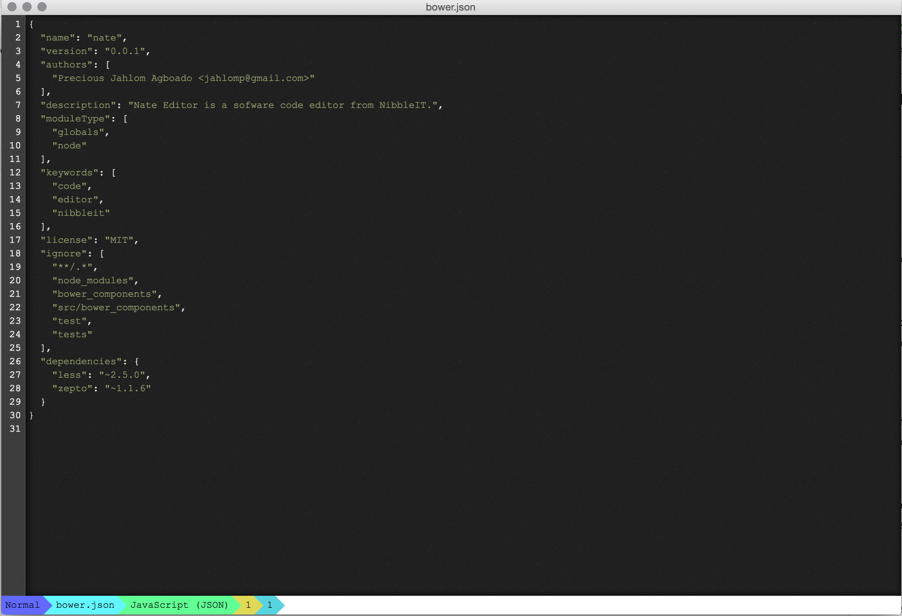

Nate
=========

Nate is a sofware code editor from NibbleIT.

Implementation
==============

## Requirements

Nodejs, bower and grunt-cli should be installed.

## Installation

Node dependencies

    npm install

Bower dependencies

    bower install

Build the project and binaries for win, linux and mac os

    grunt

After running the commands, three directories will be created
* build - contains the files which will be used to build the editor
* cache - contains the node-webkit runtime for building the editor
* webkitbuilds - contains the binaries for the three major operating systems, Mac, Windows and Linux.

Contribution
============

For infomation on contribution, [click](CONTRIBUTING.md) here.