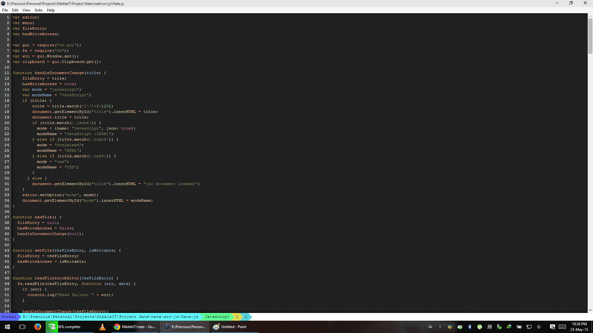

Nate
=========

Nate is a sofware code editor from NibbleIT.

Implementation
==============

## Requirements
The following is required to be able to install the dependencies of nate code editor.
Install them if not on system before installing the dependencies.

Nodejs, bower and grunt-cli should be installed.
    
    Install node.js if it is not on system. Refer to node.js main site for procedure.
    
    Bower Installation In Linux Terminal:
     npm install -g bower
     
    Grunt installation In Linux Terminal:
     npm install -g grunt-cli
    
## Installation Of Dependencies for Nate.

Node dependencies

    npm install

Bower dependencies

    bower install

Build the project and binaries for win, linux and mac os

    grunt

After running the commands, three directories will be created
* build - contains the files which will be used to build the editor
* cache - contains the node-webkit runtime for building the editor
* webkitbuilds - contains the binaries for the three major operating systems, Mac, Windows and Linux.

How to contribute
============

For infomation on contribution, [click](CONTRIBUTING.md) here.
